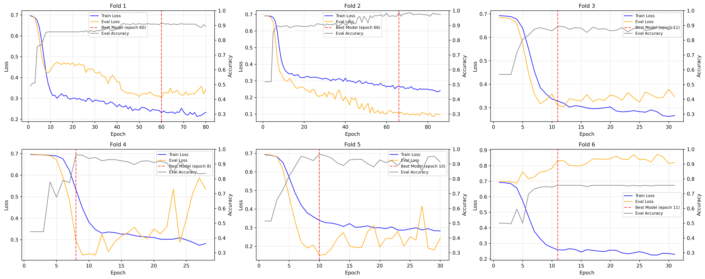
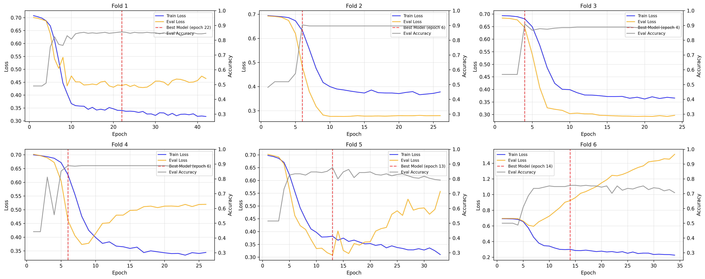
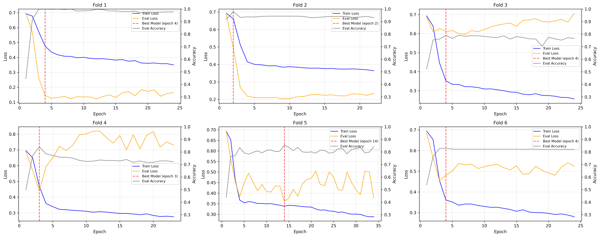
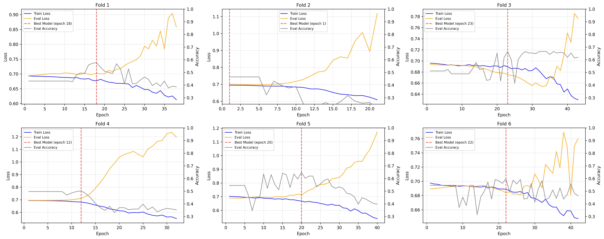
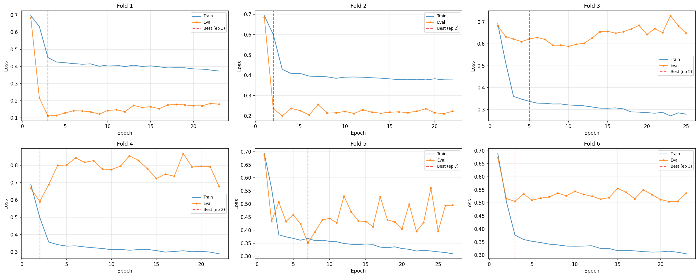
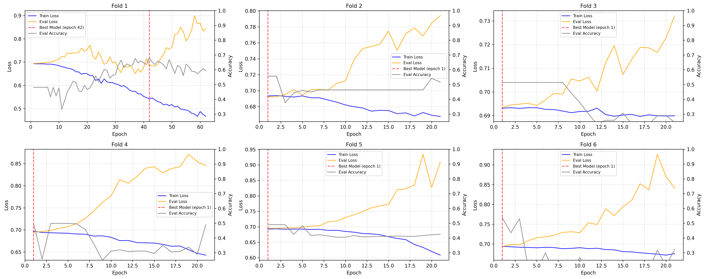
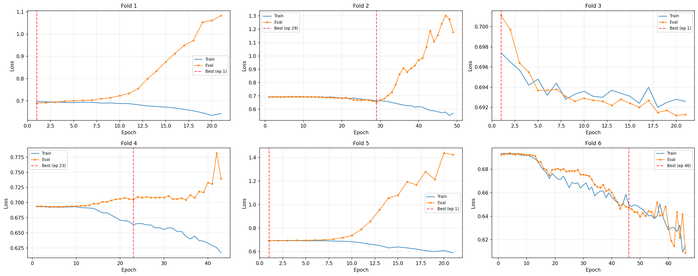
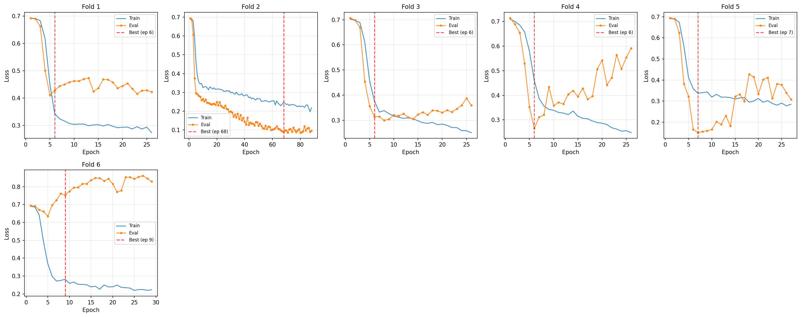
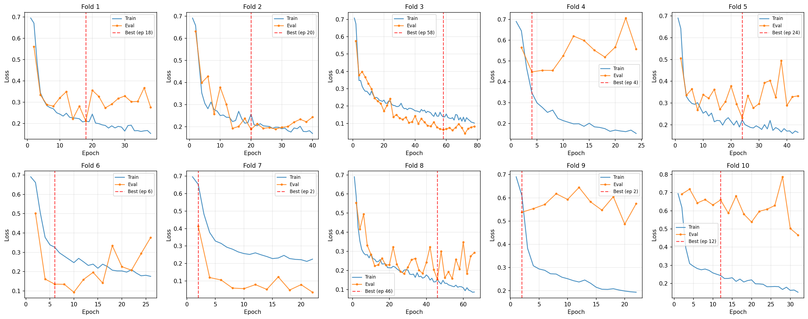

# Experiments

## Summary Table: Comparing Experiments

| Experiment                                   | Dataset | Channel | Condition | Batch | Model         | Dropout | Chunk Acc (Min-Max)              | Subject Acc (Min-Max)       | Key Observation                                                                                            |
|----------------------------------------------|---------|---------|-----------|-------|---------------|---------|----------------------------------|-----------------------------|------------------------------------------------------------------------------------------------------------|
| **mdd_006_fp1_ec**                           | MDD     | Fp1     | EC        | 64    | Original      | 0.5     | 91.3% ± 7.7% (75.6-98.6%)        | 94.0% ± 9.4% (75.0-100%)    |                                                                                                            |
| mdd_006_t4_ec                                | MDD     | T4      | EC        | 64    | Original      | 0.5     | 86.5% ± 5.2% (75.6-91.0%)        | 88.6% ± 7.3% (75.0-100%)    |                                                                                                            |
| **mdd_006_t3_ec+eo**                         | MDD     | T3      | EC+EO     | 64    | Original      | 0.4     | 88.3% ± 7.9% (79.1-100%)         | 89.1% ± 8.2% (79.0-100%)    |                                                                                                            |
| **mdd_008_t3_ec+eo_smaller**                 | MDD     | T3      | EC+EO     | 64    | Smaller       | 0.1     | 86.4% ± 7.5% (77.8-98.5%)        | 88.2% ± 7.4% (78.9-100%)    | Behaves very similar considering it's ~50% smaller                                                         |
| **mdd_006_t4_ec+eo**                         | MDD     | T4      | EC+EO     | 64    | Original      | 0.4     | 87.3% ± 8.1% (75.9-100%)         | 89.2% ± 6.3% (83.3-100%)    |                                                                                                            |
| cane_006_fp1_ec (baseline)                   | CANE    | Fp1     | EC        | 64    | Original      | 0.5     | 57.6%                            | 61.9%                       |                                                                                                            |
| cane_008_t7_ec_og                            | CANE    | T7      | EC        | 32    | Original      | 0.8     | 48.0%                            | 48.8%                       | All 6 folds peaked at epoch 1 - complete learning failure                                                  |
| cane_008_t7_ec_og_rnd                        | CANE    | T7      | EC        | 32    | Original      | 0.1     | 61.2%                            | 62.7%                       | 3/6 folds at epoch 1, high variance                                                                        |
| cane_008_t7_ec_smaller                       | CANE    | T7      | EC        | 32    | Smaller       | 0.5     | 61.0%                            | 62.7%                       | 2/6 folds peaked at epoch 1, some learning                                                                 |
| **cane_008_t7_ec_smaller_lwa**               | CANE    | T7      | EC        | 32    | Smaller       | 0.1     | **62.2% (53.6%-81.8%)**          | 65.1%                       | Better learning, but still 3/6 folds at epoch 1                                                            |
| cane_012b_t7_ec_smaller_skip                 | CANE    | T7      | EC        | 64    | Smaller       | 0.1     | 61.98% ± 6.91% (54.55% - 73.30%) | 65.08%                      | --skip-artifact-removal minimal effect; tried also with EC+EO, ended up poorly (chunk acc: 54.38% ± 6.93%) |
| **Transfer Learning (009: freeze CNN only)** |         |         |           |       |               |         |                                  |                             |                                                                                                            |
| cane_009_fp1_ec_transfer                     | CANE    | Fp1     | EC        | 64    | Transfer      | 0.5     | 61.1% ± 12.7% (43.2-78.4%)       | 65.5% ± 18.0% (42.9-83.3%)  | Best fold 78.4% chunk; high variance; 1/6 folds at epoch 1                                                 |
| cane_009_t8_ec_transfer                      | CANE    | T8      | EC        | 64    | Transfer      | 0.5     | 49.1% ± 6.8% (37.7-56.3%)        | 48.8% ± 10.0% (33.3-66.7%)  | 3/6 folds at epoch 1 - T8 transfer worse than baseline                                                     |
| cane_009_t8_ec_transfer_lowdrop              | CANE    | T8      | EC        | 64    | Transfer      | 0.1     | 51.7% ± 10.5% (35.5-65.9%)       | 54.4% ± 13.2% (33.3-66.7%)  | 3/6 folds at epoch 1; low dropout didn't help T8                                                           |
| **Transfer Learning (010: freeze CNN+LSTM)** |         |         |           |       |               |         |                                  |                             |                                                                                                            |
| cane_010_fp1_ec_transfer                     | CANE    | Fp1     | EC        | 64    | Transfer      | 0.5     | 60.0% ± 11.8% (36.4-72.1%)       | 59.9% ± 9.8% (42.9-66.7%)   | 2/6 folds at epoch 1; only classifier trainable                                                            |
| cane_010_fp1_ec_transfer_lowdrop             | CANE    | Fp1     | EC        | 64    | Transfer      | 0.1     | 61.0% ± 13.7% (43.2-81.8%)       | 68.3% ± 19.2% (42.9-100%)   | Freeze CNN+LSTM; Fold 3 achieved 81.8% chunk                                                               |
| **011 Series (Augmentation & Freeze LSTM)**  |         |         |           |       |               |         |                                  |                             |                                                                                                            |
| mdd_011_t3_ec+eo_smaller                     | MDD     | T3      | EC+EO     | 64    | Smaller       | 0.1     | 87.5% ± 7.5% (78.5-100%)         | 88.3% ± 7.2% (78.9-100%)    | **+1.1%** with 20% augment vs mdd_008                                                                      |
| mdd_011_t3_ec+eo_smaller_more                | MDD     | T3      | EC+EO     | 64    | Smaller       | 0.1     | 86.8% ± 8.4% (77.6-100%)         | 87.4% ± 8.1% (77.8-100%)    | 30% augment too much; Fold 4 epoch 1                                                                       |
| **cane_011_fp1_ec_transfer_lowdrop**         | CANE    | Fp1     | EC        | 64    | Transfer (OG) | 0.1     | **68.6% ± 12.6% (50.8-90.3%)**   | **73.0% ± 15.5% (50-100%)** | **Best CANE**: Freeze LSTM only; Fold 3=90.3%/100%, experiments/mdd_006_fp1_ec                             |
| cane_011_t7_ec+eo_transfer_lowdrop_tcl       | CANE    | T7      | EC        | 64    | Smaller       | 0.1     | 52.6% ± 7.0% (43.2-65.9%)        | 51.6% ± 7.2% (42.9-66.7%)   | **FAILED**: 5/6 folds epoch 1; T3→T7 transfer, frozen LSTM                                                 |
| cane_011_t7_ec_smaller_lowdrop_fqm           | CANE    | T7      | EC        | 64    | Smaller       | 0.1     | 56.8% ± 7.7% (45.5-67.5%)        | 59.5% ± 7.5% (50-66.7%)     | 20% augment **hurts** T7 (-5.4% vs cane_008 baseline); 3/6 epoch 1                                         |
| **both_012b_t3_ec_smaller**                  | BOTH    | T3      | EC        | 64    | Smaller       | 0.1     | 67.48% ± 6.38% (53.88%-72.73%)   | 71.18% ± 7.17% (57.14%-81.25%) | Normal: 93.2%/89.2%, MDD: 73.3%/66.9%, Anxious: **11.1%/13.1%** - CANE classification fails          |
| **both_012b_t3_ec+eo_smaller_hcf**           | BOTH    | T3      | EC+EO     | 64    | Smaller       | 0.1     | 73.35% ± 6.12% (65.82%-81.53%)   | 77.83% ± 5.87% (70.97%-86.67%) | Normal: 79.0%/79.3%, MDD: **94.4%/85.7%**, Anxious: 47.2%/38.8% - EC+EO boosts anxious detection   |
| cane_012b_t7_ec_smaller_skip                 | CANE    | T7      | EC        | 64    | Smaller       | 0.1     | 61.98% ± 6.91% (54.55%-73.30%)   | 65.08% ± 10.26% (50%-83.33%)    | --skip-artifact-removal minimal effect vs cane_008_t7_ec_smaller_lwa (62.2%)                         |
| cane_012b_t7_ec+eo_smaller_skip              | CANE    | T7      | EC+EO     | 64    | Smaller       | 0.1     | 54.38% ± 6.93% (48.58%-68.54%)   | 56.91% ± 10.17% (50%-78.57%)    | EC+EO **worse** than EC-only for CANE; 4/6 folds peaked at epoch 1 - learning failure                |
| cane_012b_t7_ec+eo_smaller_no_skip           | CANE    | T7      | EC+EO     | 64    | Smaller       | 0.1     | 53.48% ± 5.25% (48.58%-63.75%)   | 55.52% ± 10.44% (50%-78.57%)    | Artifact removal ON slightly **worse** (53.5% vs 54.4%); 5/6 folds at epoch 1                        |

## 012b Analysis

### Executive Summary

The 012b experiments tested two main hypotheses: (1) skipping artifact removal to improve CANE performance on T7, and (2) training a multi-class model on both datasets simultaneously. **Key findings**:

- **Artifact removal skip**: Minimal to no benefit for CANE T7 (61.98% vs 62.2% baseline)
- **EC+EO for CANE**: Counterintuitively **worse** than EC-only (54.4% vs 62.0%), with 4-5/6 folds failing to learn
- **Multi-dataset training (BOTH)**: Shows promise with 73.4% chunk accuracy on EC+EO
  - **Critical issue**: Severe class imbalance - Anxious class recall is catastrophically low (11-47% subject-level)
  - Normal: 79-93%, MDD: 86-94% recall → model biased against CANE subjects

### Detailed Experiment Review

#### **CANE Experiments (T7 channel, Smaller model)**

All three CANE 012b experiments share the same hyperparameters (batch=64, dropout=0.1, Smaller model) and test preprocessing variations:

| Experiment                             | Artifact Removal | Condition | Chunk Acc      | Folds at Epoch 1 | Analysis                                                |
|----------------------------------------|------------------|-----------|----------------|------------------|---------------------------------------------------------|
| **cane_012b_t7_ec_smaller_skip**       | Skip             | EC        | 61.98% ± 6.91% | 2/6              | Artifact skip has **no benefit** vs baseline (62.2%)    |
| **cane_012b_t7_ec+eo_smaller_skip**    | Skip             | EC+EO     | 54.38% ± 6.93% | 4/6              | EC+EO **dramatically worse**; learning failure          |
| **cane_012b_t7_ec+eo_smaller_no_skip** | Standard         | EC+EO     | 53.48% ± 5.25% | 5/6              | Keeping artifact removal **even worse**; 5/6 folds fail |

**Key Insight**: The EC+EO condition is fundamentally problematic for CANE with current architecture:
- Doubling data doesn't help - it makes things worse
- Possible causes: (1) EC and EO anxiety patterns may be contradictory/confusing, (2) insufficient model capacity, (3) more data exposes overfitting to training initialization

#### **Multi-Dataset Experiments (BOTH dataset, T3 channel)**

**both_012b_t3_ec_smaller** (EC-only, 3-class):
- **Overall**: 67.5% chunk / 71.2% subject accuracy
- **Per-class breakdown (Subject/Chunk recall)**:
  - Normal: 93.2% / 89.2% ✓ Excellent
  - MDD: 73.3% / 66.9% ✓ Acceptable
  - Anxious: **11.1% / 13.1%** ✗ **FAILURE**
- **Analysis**: Model essentially ignores anxious class - just 1 in 9 anxious subjects correctly classified

**both_012b_t3_ec+eo_smaller_hcf** (EC+EO, 3-class):
- **Overall**: 73.4% chunk / 77.8% subject accuracy (+6% improvement with EC+EO!)
- **Per-class breakdown (Subject/Chunk recall)**:
  - Normal: 79.0% / 79.3% ✓ Good
  - MDD: **94.4% / 85.7%** ✓ **Excellent**
  - Anxious: 47.2% / 38.8% ⚠ Still poor, but **4x better** than EC-only
- **Analysis**: EC+EO helps anxiety detection significantly, but still biased

**Critical Finding**: The model has severe class imbalance issues when combining datasets. Anxious subjects are systematically underrepresented or misclassified as Normal/MDD.

### Root Cause Analysis

**Why does multi-dataset training fail for CANE subjects?**

1. **Dataset size imbalance**: MDD has ~60 subjects, CANE has ~39 subjects
   - Even with stratified folding, CANE subjects are minority in training batches
   - Model optimizes for MDD performance at expense of CANE

2. **Different EEG characteristics**: Depression vs anxiety have different neural signatures
   - Model learns MDD patterns as "primary abnormality", treats CANE as noise
   - Frontal asymmetry (depression) is stronger signal than anxiety markers

3. **Cross-dataset generalization**: Model trained on MDD Fp1 struggles with CANE T7/T3
   - Channel location matters - T3 may not capture anxiety biomarkers well
   - EC+EO helps because it provides more temporal context for anxiety patterns

4. **Training dynamics**: With 3 classes and imbalanced data, loss surface is complex
   - Early stopping based on overall chunk accuracy doesn't protect minority class
   - Need class-balanced loss or per-class early stopping criteria

### Comparative Analysis

**EC vs EC+EO Impact by Dataset:**

| Dataset | EC Chunk Acc | EC+EO Chunk Acc | Δ | Interpretation |
|---------|-------------|-----------------|---|----------------|
| CANE (T7) | 61.98% | 54.38% | **-7.6%** | EC+EO **hurts** CANE single-dataset |
| BOTH (T3) | 67.48% | 73.35% | **+5.9%** | EC+EO **helps** multi-dataset |

**Hypothesis**: EC+EO benefits multi-dataset training because:
- More data per subject helps separate depression vs anxiety temporal dynamics
- Combined conditions expose different aspects of each disorder
- For single-dataset CANE, EC+EO just adds noise without helping separation

**Artifact Removal Impact:**
- Skip vs Standard on CANE EC+EO: 54.38% vs 53.48% (negligible +0.9%)
- **Conclusion**: Artifact removal is not the bottleneck for CANE performance

### Recommendations (Prioritized by Expected Impact)

**Priority 1: Address Class Imbalance in Multi-Dataset Training**
- [ ] Implement class-weighted loss function (weight Anxious class ~2-3x higher)
- [ ] Try balanced batch sampling - ensure each batch has Normal/MDD/Anxious examples
- [ ] Monitor per-class metrics during training, add per-class early stopping
- [ ] Expected impact: +20-30% anxious recall

**Priority 2: Abandon EC+EO for Single-Dataset CANE**
- [ ] EC+EO consistently hurts CANE T7 performance
- [ ] Stick with EC-only for future CANE experiments
- [ ] If need more data, try augmentation instead of adding EO condition

**Priority 3: Try Different Channels for Anxious Detection**
- [ ] T3 shows 11% anxious recall, T7 is untested in multi-dataset
- [ ] Try Fp1 or Fp2 for BOTH dataset (frontal regions involved in anxiety)
- [ ] Hypothesis: Temporal channels (T3/T7) may not capture anxiety biomarkers

**Priority 4: Architecture Modifications for 3-Class Problem**
- [ ] Current model designed for binary classification
- [ ] Try increasing classifier capacity (add layer, increase hidden dims)
- [ ] Consider separate feature extractors for depression vs anxiety detection
- [ ] Multi-task learning: auxiliary binary tasks (normal vs abnormal, depression vs anxiety)

**Priority 5: Dataset-Specific Preprocessing**
- [ ] Current artifact removal is CANE-specific (`skip_extreme_artifacts=True`)
- [ ] Investigate if harmonizing preprocessing across datasets helps
- [ ] Try removing common noise transform to make model channel-independent

**De-prioritized**:
- ~~Skipping artifact removal~~ - No meaningful impact (tested)
- ~~Larger batch sizes~~ - Already at 64, hardware limit likely
- ~~Lower dropout~~ - Already at 0.1, further reduction risks overfitting

## 011 Analysis

### Next steps for transfer learning

Figure out how exaclty does augmentation is applyied per chunk or per recording? how many times is called focuntion
for preprocessing? is it cached or not? disable the creating spectgram prints, make it debug

1. Combine winners: Try CANE transfer with frozen LSTM + 20% augmentation - cant say it improved anything
2. Try EC+EO on CANE transfer: Current best uses EC only
3. Different pretrained source: Use fold 3 or 4 of MDD instead of fold 1
4. different seed

do the same thing then with different seed


Possible explanations:
1. Bad initialization - T3 pretrained weights gave CNN a poor starting point for T7, harder to recover from than random init
2. LSTM temporal patterns are channel-specific too - the frozen LSTM learned T3-specific temporal dynamics that don't apply to T7
3. Smaller model - less capacity to overcome bad initialization

This actually suggests LSTM features might be more channel-dependent than expected. The frozen LSTM could be the bottleneck.

Test idea: Try the same T3→T7 transfer but freeze CNN instead of LSTM (let LSTM adapt). Or try no freezing at all - just use pretrained weights as initialization.
### Key Findings

**Data Augmentation (MDD):**
- 20% augmentation provides modest improvement (+1.1% chunk accuracy)
- 30% augmentation degrades performance - too aggressive
- Fold convergence is faster with augmentation (epochs 3-5 vs 5-17)

**Transfer Learning Architecture (CANE):**
- **Freezing LSTM only (train CNN + classifier)** is the best configuration
- 68.6% mean chunk accuracy vs 61.0% with frozen CNN+LSTM
- Fold 3 achieves 90.3% chunk / 100% subject - best CANE result ever

ICA on full model - will it make a difference or not?

# 12 beta
My double code: 
python main.py train --skip-ica --channel T3 --batch-size 64 --checkpoint-dir=experiments/both_012b_t3_ec+eo_smaller --dataset both --model Smaller --condition ec+eo --n-folds 6 --dropout 0.1 --weight-decay 1e-4 --val-every 1

check the recall: experiments/both_012b_t3_ec+eo_smaller_hcf it's not good, CANE is quite bad, any other dataset I could try?

only ec:
```bash
python main.py train --skip-ica --channel T7 --batch-size 64 --checkpoint-dir=experiments/both_012b_t3_ec_smaller --dataset both --model Smaller --condition ec --n-folds 6 --dropout 0.1 --weight-decay 1e-4 --val-every 1
```


Tryna improve cane_008_t7_ec_smaller_lwa by skipping artifact removal
```bash
python main.py train --skip-ica \
--skip-artifact-removal  \
--channel T7 \
--batch-size 64 \
--checkpoint-dir=experiments/cane_012b_t7_ec_smaller_skip \
--dataset cane \
--condition ec \
--n-folds 6 \
--dropout 0.1 \
--weight-decay 1e-4 \
--val-every 1 \
--model Smaller
```

- results here: experiments/cane_012b_t7_ec_smaller_skip/cv_results.txt

Same as above, but both EC+EO:

```bash
python main.py train --skip-ica \
--skip-artifact-removal  \
--channel T7 \
--batch-size 64 \
--checkpoint-dir=experiments/cane_012b_t7_ec+eo_smaller_skip \
--dataset cane \
--condition ec+eo \
--n-folds 6 \
--dropout 0.1 \
--weight-decay 1e-4 \
--val-every 1 \
--model Smaller
```

- results: experiments/cane_012b_t7_ec+eo_smaller_skip

no skip, also slightly worse than without skipping the artifact removal:

```bash
python main.py train --skip-ica \
--channel T7 \
--batch-size 64 \
--checkpoint-dir=experiments/cane_012b_t7_ec+eo_smaller_no_skip \
--dataset cane \
--condition ec+eo \
--n-folds 6 \
--dropout 0.1 \
--weight-decay 1e-4 \
--val-every 1 \
--model Smaller
```
### 011 configurations 

Transfer training, freezing only LSTP

```bash
poetry run python main.py train --skip-ica \
--channel Fp1 \
--batch-size 64 \
--checkpoint-dir=experiments/cane_011_fp1_ec_transfer_lowdrop \
--dataset cane \
--condition ec \
--n-folds 6 \
--dropout 0.1 \
--weight-decay 1e-4 \
--val-every 1 \
--pretrained-checkpoint experiments/mdd_006_fp1_ec/fold_1_best.pth \
--freeze-lstm
```

the same thing, just for T7 on EC+EO
mdd_008_t3_ec+eo_smaller transfer from this, oc+eo, lstm-freeze t7:

```bash
poetry run python main.py train --skip-ica \
--channel T7 \
--batch-size 64 \
--checkpoint-dir=experiments/cane_011_t7_ec+eo_transfer_lowdrop_tcl \
--dataset cane \
--condition ec \
--n-folds 6 \
--dropout 0.1 \
--weight-decay 1e-4 \
--val-every 1 \
--pretrained-checkpoint experiments/mdd_008_t3_ec+eo_smaller/fold_1_best.pth \
--freeze-lstm \
--model Smaller
```
- out dir: `experiments/cane_011_t7_ec+eo_transfer_lowdrop_tcl`

- [ ] TODO: Now adding augmentation

```bash
poetry run python main.py train --skip-ica \
--channel T7 \
--batch-size 64 \
--checkpoint-dir=experiments/cane_011_t7_ec+eo_transfer_lowdrop \
--dataset cane \
--condition ec \
--n-folds 6 \
--dropout 0.1 \
--weight-decay 1e-4 \
--val-every 1 \
--pretrained-checkpoint experiments/mdd_008_t3_ec+eo_smaller/fold_1_best.pth \
--freeze-lstm \
--model Smaller \
--augment-data 0.15
```

| **cane_008_t7_ec_smaller_lwa**                         | CANE    | T7      | EC        | 32    | Smaller  | 0.1     | **62.2% (53.6%-81.8%)**        | 65.1%                      | Better learning, but still 3/6 folds at epoch 1            |
1. 64 batch, avoid artifact processing
2. add augumaentation

```bash
python main.py train --skip-ica \
--channel T7 \
--batch-size 64 \
--checkpoint-dir=experiments/cane_011_t7_ec_smaller_lowdrop \
--dataset cane \
--condition ec \
--n-folds 6 \
--dropout 0.1 \
--weight-decay 1e-4 \
--val-every 1 \
--model Smaller \
--augument-data 0.2
```

3. add augumentation + EO+EC

try augmentation on MDD

```bash
python main.py train --skip-ica \
--channel T3 \
--batch-size 64 \
--checkpoint-dir=experiments/mdd_011_t3_ec+eo_smaller \
--dataset mdd \
--model Smaller \
--condition ec+eo \
--n-folds 6 \
--dropout 0.1 \
--weight-decay 1e-4 \
--augment-data 0.2 \
--val-every 1
```


```bash
python main.py train --skip-ica \
--channel T3 \
--batch-size 64 \
--checkpoint-dir=experiments/mdd_011_t3_ec+eo_smaller_more \
--dataset mdd \
--model Smaller \
--condition ec+eo \
--n-folds 6 \
--dropout 0.1 \
--weight-decay 1e-4 \
--augment-data 0.3 \
--val-every 1
```

## 009+010: Transfer learning

Transfer learning provides marginal but consistent improvement (~3-4% mean chunk accuracy) over baseline CANE training,
with the best configuration being Fp1 transfer with frozen CNN+LSTM and low dropout (0.1), which achieved one fold with
81.8% chunk accuracy. However, the fundamental challenge of high cross-subject variability in the CANE dataset remains
unsolved.

T8 completely failed on the transfer.

Suggestions:
- Data augmentation for problematic subjects - Folds 1 and 5 consistently underperform. Consider time-domain
   augmentation (jittering, scaling) to increase effective training data.
- Try different pretrained folds - All experiments use fold_1_best.pth. Try transfer from fold 3 or fold 4 which may
   have learned more generalizable features.
- Increase classifier capacity - With frozen CNN+LSTM (only 8,610 trainable params), consider adding another dense layer
  or increasing hidden dimensions in the classifier head.

Parameter breakdown:
| Layer                        | Params  |
|------------------------------|---------|
| CNN (conv1 + conv2)          | 57,696  |
| LSTM                         | 732,000 |
| Classifier (fc1 + fc2 + out) | 8,610   |
| Total                        | 798,306 |

Freezing options:
- --freeze-cnn: 740,610 trainable (93%) - LSTM + classifier
- --freeze-lstm + --freeze-cnn: 8,610 trainable (1%) - classifier only (implies --freeze-cnn)
- --freeze-lstm: **68.6% chunk accuracy** - best CANE result!

## Key Insights from 008 Experiments

- Model size reduction made minimal difference for CANE
  - I think I can try tweak some params for this setup: **cane_008_t7_ec_smaller_lwa**, but the loss curves still look bad
  - [ ] **TODO**: try what Fp1, T7 does with 64 batch, maybe no dropout and ec+eo?
- For MDD, making the model smaller and lowering dropout leads to very similar results for a single channel.
  - meaning, I can easily save 50% on compute without much difference in the service provided

 
## Key Insights from 006 Experiments

### 1. Batch Size Impact on MDD

- **fp1_006_mdd_ec (batch 64)**: 94.0% vs **fp1_004_mdd_ec (batch 32)**: 90.5%
- ~3.5% improvement, though variance increased (±9.4% vs ±8.4%)
- **Conclusion**: Larger batches provide more stable gradients and better learning on limited data

### 2. Fp1 Channel Confirmed as Best for Depression

- **Fp1**: 94.0% vs **T4**: 88.6%
- **Reason**: Frontal asymmetry is the key biomarker for depression — T4 (right temporal) misses this critical signal

### 3. CANE Dataset Performance Issues

- **Fp1 channel performance**: 61.9% (essentially random for 2-class classification)
- **Critical issue**: In `cane_006_t8_ec+eo`, 5 out of 6 folds peaked at epoch 1:
  - Fold 1: best at epoch 1
  - Fold 2: best at epoch 1
  - Fold 3: best at epoch 1
  - Fold 4: best at epoch 1
  - Fold 5: best at epoch 1
  - Fold 6: best at epoch 12 ← only fold that showed learning
- **Conclusion**: Model cannot learn from this data with current architecture

### 4. The "Fold 6 Problem" in MDD

Both MDD experiments show Fold 6 performing significantly worse:
- **mdd_006_fp1_ec Fold 6**: 75.0% subject accuracy (vs 100% in other folds)
- **mdd_006_t4_ec Fold 6**: 75.0% subject accuracy
- **Hypothesis**: 1-2 subjects in that fold are fundamentally hard to classify

### Priorities Moving Forward

**Priority 1: MDD results are satisfactory**
- 94% subject accuracy with Fp1/EC/batch64 is solid for ~60 subjects
- High variance is inherent to small-sample EEG studies

**Priority 2: Re-evaluate CANE approach**
- Current model architecture cannot learn anxiety patterns with 39 subjects
- Consider alternative approaches or architectures 

## 009 + 010 

```bash
poetry run python main.py train --skip-ica \
--channel Fp1 \
--batch-size 64 \
--checkpoint-dir=experiments/cane_010_fp1_ec_transfer \
--dataset cane \
--condition ec \
--n-folds 6 \
--dropout 0.5 \
--weight-decay 1e-4 \
--val-every 1 \
--pretrained-checkpoint experiments/mdd_006_fp1_ec/fold_1_best.pth \
--freeze-cnn \
--freeze-lstm
```


```bash
poetry run python main.py train --skip-ica \
--channel Fp1 \
--batch-size 64 \
--checkpoint-dir=experiments/cane_010_fp1_ec_transfer_lowdrop \
--dataset cane \
--condition ec \
--n-folds 6 \
--dropout 0.1 \
--weight-decay 1e-4 \
--val-every 1 \
--pretrained-checkpoint experiments/mdd_006_fp1_ec/fold_1_best.pth \
--freeze-cnn \
--freeze-lstm
```

```bash
poetry run python main.py train --skip-ica \
--channel Fp1 \
--batch-size 64 \
--checkpoint-dir=experiments/cane_009_fp1_ec_transfer \
--dataset cane \
--condition ec \
--n-folds 6 \
--dropout 0.5 \
--weight-decay 1e-4 \
--val-every 1 \
--pretrained-checkpoint experiments/mdd_006_fp1_ec/fold_1_best.pth \
--freeze-cnn
```


```bash
poetry run python main.py train --skip-ica \
--channel T8 \
--batch-size 64 \
--checkpoint-dir=experiments/cane_009_t8_ec_transfer \
--dataset cane \
--condition ec \
--n-folds 6 \
--dropout 0.5 \
--weight-decay 1e-4 \
--val-every 1 \
--pretrained-checkpoint experiments/mdd_006_t4_ec/fold_1_best.pth \
--freeze-cnn
```


```bash
poetry run python main.py train --skip-ica \
--channel T8 \
--batch-size 64 \
--checkpoint-dir=experiments/cane_009_t8_ec_transfer_lowdrop \
--dataset cane \
--condition ec \
--n-folds 6 \
--dropout 0.1 \
--weight-decay 1e-4 \
--val-every 1 \
--pretrained-checkpoint experiments/mdd_006_t4_ec/fold_1_best.pth \
--freeze-cnn
```

## 006 for T4

```bash
python main.py train --skip-ica \
--channel T4 \
--batch-size 64 \
--checkpoint-dir=experiments/mdd_006_t4_ec+eo \
--dataset mdd \
--condition ec+eo \
--n-folds 6 \
--dropout 0.4 \
--weight-decay 1e-4 \
--val-every 1
```

## How I was running 008 batch (Smaller model)

```bash
python main.py train --skip-ica \
--channel T7 \
--batch-size 32 \
--checkpoint-dir=experiments/cane_008_t7_ec_smaller \
--dataset cane \
--condition ec \
--n-folds 6 \
--dropout 0.5 \
--weight-decay 1e-4 \
--val-every 1 \
--model Smaller
```

- Output dir: `experiments/cane_008_t7_ec_smaller`

```bash
python main.py train --skip-ica \
--channel T7 \
--batch-size 32 \
--checkpoint-dir=experiments/cane_008_t7_ec_smaller \
--dataset cane \
--condition ec \
--n-folds 6 \
--dropout 0.1 \
--weight-decay 1e-4 \
--val-every 1 \
--model Smaller
```

- Output dir: `experiments/cane_008_t7_ec_smaller_lwa`

```bash
python main.py train --skip-ica \
--channel T7 \
--batch-size 32 \
--checkpoint-dir=experiments/cane_008_t7_ec_og \
--dataset cane \
--condition ec \
--n-folds 6 \
--dropout 0.5 \
--weight-decay 1e-4 \
--val-every 1
```

- Output dir: `experiments/cane_008_t7_ec_og_rnd`

```bash
python main.py train --skip-ica \
--channel T7 \
--batch-size 32 \
--checkpoint-dir=experiments/cane_008_t7_ec_og \
--dataset cane experiments/cane_008_t7_ec_og_rnd\
--condition ec \
--n-folds 6 \
--dropout 0.1 \
--weight-decay 1e-4 \
--val-every 1
```

- Output dir: `experiments/cane_008_t7_ec_og_rnd`


```bash
python main.py train --skip-ica \
--channel T3 \
--batch-size 64 \
--checkpoint-dir=experiments/mdd_008_t3_ec+eo_smaller \
--dataset mdd \
--model Smaller \
--condition ec+eo \
--n-folds 6 \
--dropout 0.1 \
--weight-decay 1e-4 \
--val-every 1
```

- Output dir: 

## Detailed Experiment Results (006 Series)

### MDD Fp1 EC 006

```bash
python main.py train --skip-ica \
--channel Fp1 \
--batch-size 64 \
--checkpoint-dir=experiments/mdd_006_fp1_ec \
--dataset mdd \
--condition ec \
--n-folds 6 \
--dropout 0.5 \
--weight-decay 1e-4 \
--val-every 1
```

**Results:**
- SUBJECT Accuracy Mean: 0.9398 ± 0.0941, Min: 0.7500, Max: 1.0000
- CHUNK Accuracy Mean: 0.9125 ± 0.0771, Min: 0.7562, Max: 0.9862



### MDD T4 EC 006

```bash
python main.py train --skip-ica \
--channel T4 \
--batch-size 64 \
--checkpoint-dir=experiments/mdd_006_t4_ec \
--dataset mdd \
--condition ec \
--n-folds 6 \
--dropout 0.5 \
--weight-decay 1e-4 \
--val-every 1
```

**Results:**
- SUBJECT Accuracy Mean: 0.8856 ± 0.0730, Min: 0.7500, Max: 1.0000
- CHUNK Accuracy Mean: 0.8652 ± 0.0518, Min: 0.7562, Max: 0.9101



### MDD T3 EC+EO 006

```bash
python main.py train --skip-ica \
--channel T3 \
--batch-size 64 \
--checkpoint-dir=experiments/mdd_006_t3_ec+eo \
--dataset mdd \
--condition ec+eo \
--n-folds 6 \
--dropout 0.4 \
--weight-decay 1e-4 \
--val-every 1
```

**Results:**
- SUBJECT Accuracy Mean: 0.8912 ± 0.0815, Min: 0.7895, Max: 1.0000
- CHUNK Accuracy Mean: 0.8828 ± 0.0785, Min: 0.7906, Max: 1.0000



### CANE Fp1 EC 006

```bash
python main.py train --skip-ica \
--channel Fp1 \
--batch-size 64 \
--checkpoint-dir=experiments/cane_006_fp1_ec \
--dataset cane \
--condition ec \
--n-folds 6 \
--dropout 0.5 \
--weight-decay 1e-4 \
--val-every 1
```

**Results:**
- SUBJECT Accuracy Mean: 0.6190 ± 0.0858, Min: 0.5000, Max: 0.7143
- CHUNK Accuracy Mean: 0.5758 ± 0.0722, Min: 0.4645, Max: 0.6648



---

## Earlier Experiments (005 Series)

### MDD+CANE EC+EO Fp1 005

```bash
python main.py train --skip-ica \
--channel Fp1 \
--batch-size 32 \
--checkpoint-dir=experiments/both_fp1_ec+eo_005 \
--dataset both \
--condition ec+eo \
--n-folds 6 \
--dropout 0.6 \
--weight-decay 1e-4 \
--val-every 1
```

**Results:**
- CHUNK Accuracy Mean: 0.7390 ± 0.0794, Min: 0.5881, Max: 0.8328


### MDD T3 EC+EO 005 (Lower Batch Size)

**Note:** TODO - try this with batch 128?

```bash
python main.py train --skip-ica \
--channel T3 \
--batch-size 16 \
--checkpoint-dir=experiments/mdd_t3_ec+eo_005 \
--dataset mdd \
--condition ec+eo \
--n-folds 6 \
--dropout 0.6 \
--weight-decay 1e-4 \
--val-every 1
```

**Results:** See [cv_results.txt](experiments/mdd_t3_ec+eo_005/cv_results.txt)



### CANE T7 EC+EO 005 (Batch Size 8)

**Observations:**
- Performance was significantly worse (see loss curves)
- Likely needs larger batch size and smaller dropout
- Combined metric in results gives inconsistent values - need separate metrics
- Loss curve plots appear broken

```bash
python main.py train --skip-ica \
--channel T7 \
--batch-size 8 \
--checkpoint-dir=experiments/cane_t7_ec+eo_005 \
--dataset cane \
--condition ec+eo \
--n-folds 6 \
--dropout 0.6 \
--weight-decay 1e-4 \
--val-every 1
```



**Second attempt with adjusted parameters:**
```bash
python main.py train --skip-ica \
--channel T7 \
--batch-size 64 \
--checkpoint-dir=experiments/cane_t7_ec+eo_005_2nd \
--dataset cane \
--condition ec+eo \
--n-folds 6 \
--dropout 0.3 \
--weight-decay 1e-4 \
--val-every 1
```

---

## Archived Experiments (004 Series and Earlier)

### CANE T7 EC 005 (Batch Size 32)

```bash
python main.py train --skip-ica \
  --channel T7 \
  --batch-size 32 \
  --checkpoint-dir=experiments/t7_005_beta_cane_ec \
  --dataset cane \
  --condition ec \
  --n-folds 6 \
  --dropout 0.5 \
  --weight-decay 1e-4 \
  --val-every 1
```



### MDD Fp1 EC+EO 005 Beta (Nov 26)

**Notes:**
- Labeled as "beta" experiment
- Directory: `experiments/fp1_005_mdd_ec`
- TODO: Re-run with current logic and consult analysis

```bash
python main.py train --skip-ica \
  --channel Fp1 \
  --batch-size 32 \
  --checkpoint-dir=experiments/fp1_005_mdd_ec \
  --dataset mdd \
  --condition ec+eo \
  --n-folds 6 \
  --dropout 0.5 \
  --weight-decay 1e-4 \
  --val-every 1
```

### MDD Fp1 EC 004 (Dropout and L2 Regularization)

```bash
python main.py train --skip-ica \
  --channel Fp1 \
  --batch-size 32 \
  --checkpoint-dir=experiments/fp1_004_mdd_ec \
  --dataset mdd \
  --condition ec \
  --n-folds 6 \
  --dropout 0.5 \
  --weight-decay 1e-4 \
  --val-every 1
```




---

### MDD Fp1 EC 003 (Nov 14)

```bash
python main.py train --skip-ica \
  --channel Fp1 \
  --batch-size 32 \
  --checkpoint-dir=checkpoints_fp1_003_mdd \
  --dataset mdd \
  --condition ec
```

**Directory:** `experiments/fp1_003_mdd_mqm`



**Analysis:**

**Positive observations:**
- Training loss consistently decreases across all folds → model is learning
- Folds 3, 6, 7, 8, 9 show decent convergence with stable eval loss

**Concerning patterns:**
- **Significant overfitting** in folds 4, 5, and 10 (large train/eval loss gap)
- **High fold variance**: Eval loss ranges from 0.1-0.2 (some folds) to 0.5-0.8 (others)
  - Suggests either highly variable data splits or model sensitivity to subject composition
- **Eval loss instability**: Oscillations in folds 1, 4, 5, 8, 10
  - Possible causes: batch size issues, learning rate too high, limited/noisy validation data

**Implemented improvements:**
- Added regularization (L2 weight decay)
- Added spatial dropout (nn.Dropout2d)
- Considering reducing model size

**Key insight:**
Given subject-level splits, high fold variance is expected. EEG signals vary dramatically between individuals due to:
- Electrode impedance differences
- Skull thickness variations
- Baseline neural patterns
- Individual physiological manifestations of depression

This reframes the problem: inconsistent eval performance is less about traditional overfitting and more about the challenge of **cross-subject generalization** in EEG-based classification.

### CANE Fp1 EC 003 (Nov 14)

**Notes:**
- Dropout 0.5 doesn't work well for CANE dataset
- Using checkpoint directory: `checkpoints_fp1_003_cane_dqr` (to avoid overwriting)

```bash
python main.py train --skip-ica \
  --channel Fp1 \
  --batch-size 32 \
  --checkpoint-dir=checkpoints_fp1_003_cane \
  --dataset cane \
  --condition ec
```

**Second attempt with lower dropout:**
- Using checkpoint directory: `checkpoints_fp1_003_cane_xhv`
